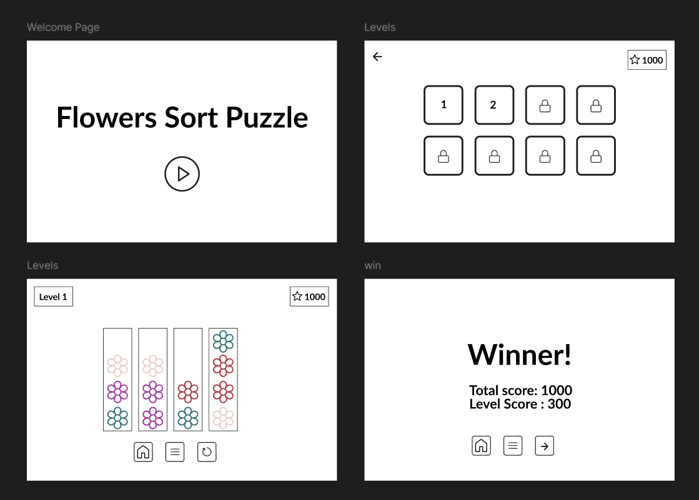

# Flowers-Sort-Puzzle

## Date: 05-02-2026

### By: Maryam Altammam

####

[GitHub](https://github.com/imryms)
[LinkedIn](https://www.linkedin.com/in/maryam-altammam/)

---

### **_Description_**

#### A puzzle game where you sort flowers by color into separate tubes.

The goal is to move flowers between tubes until each tube contains only one flower color.

---

### **_Technologies Used_**

- HTML
- CSS
- Javascript

---

### **_Getting Started_**

##### Open the game and press Play to start.

##### Choose a level from the levels screen (some levels are locked and unlock as you progress).

##### Sort the flowers by color using the game rules until you complete the level.

##### The project was deployed and can be viewed [here]( https://imryms.github.io/Flowers-Sort-Puzzle/).

---

### **Screenshots**

##### Game pages

##### Wireframes

### **_Future Updates_**

- [ ] Add more levels with increased diffculty and more colors
- [ ] Include animations and sound effects
- [ ] Improve the visual design of flowers and tubes
- [ ] Implement a timer or move counter for additional challenge

---

### **_Credits_**

##### Wireframes:https://www.figma.com/

##### Markdown Guide: [ia.net](https://ia.net/writer/support/general/markdown-guide)

##### Markdown Cheatsheet: [GitHub](https://guides.github.com/pdfs/markdown-cheatsheet-online.pdf)

---
